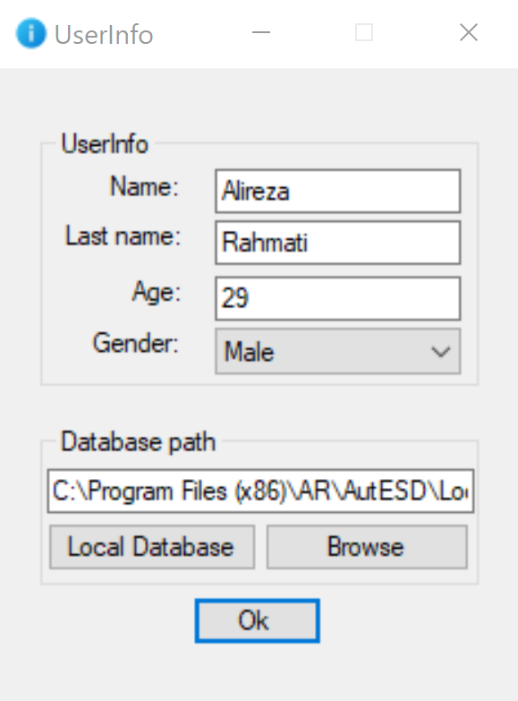
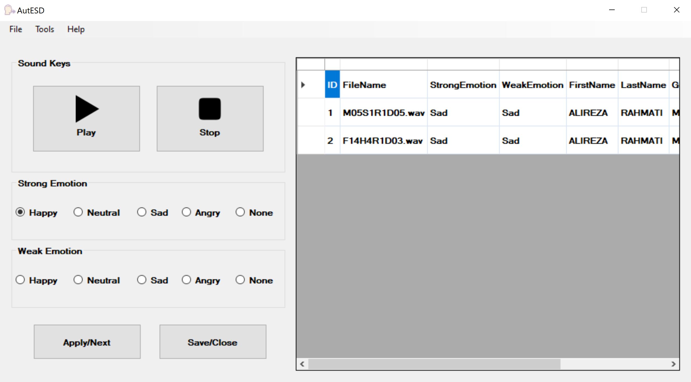
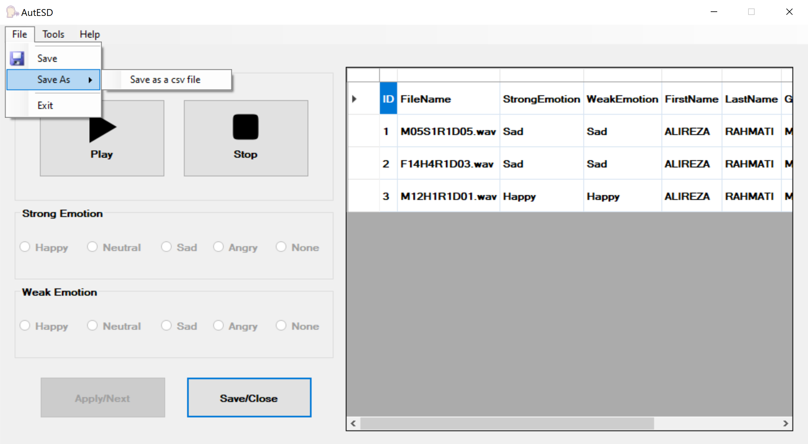
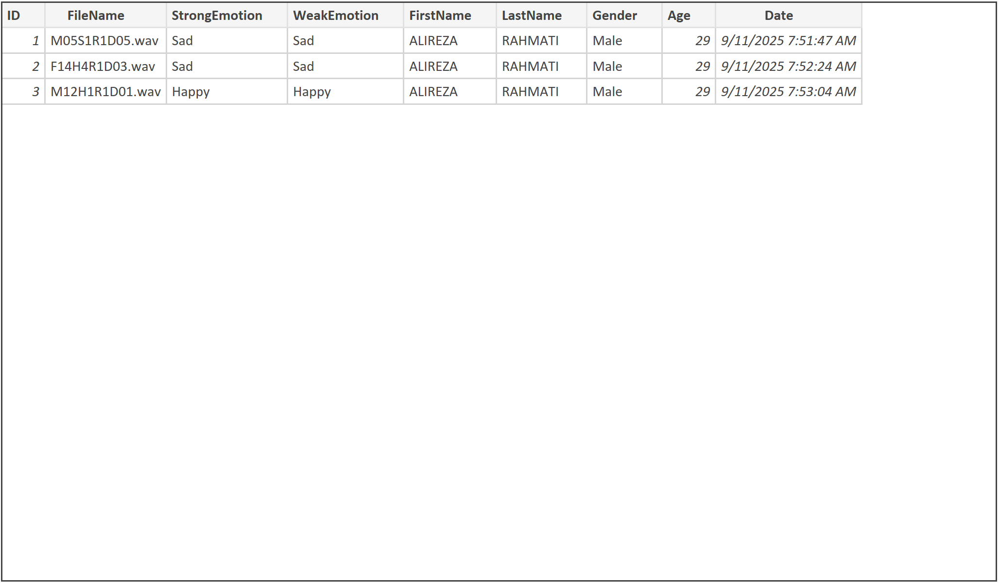

# Emotional Speech Labeling App

A **C#-based desktop application** for labeling emotional speech samples through a voter-based voting system.  
This tool was developed to help researchers collect emotional annotations efficiently while reducing time and cost.

---

## 🧠 Overview

The labeling software allows users (voters) to listen to audio recordings and vote on the perceived emotion.  
It supports **two levels of emotional strength** — *Strong* and *Weak* — each including the following options:

* **Happy**
* **Neutral**
* **Sad**
* **Angry**
* **None** — for unclear or unrecognizable emotions

Users can:

* Register personal information (name, gender, age)
* Listen to and stop audio playback
* Vote for emotions
* Save the results as **CSV** or **ZIP** files for analysis

---

## 🧩 Features

🎧 Intuitive labeling interface — simple emotion labeling with Play, Stop, and automatic save control for each audio sample

⚙️ Easy installation and use — no technical background required

👥 Scalable participation — can be used by multiple users to expand the number of annotators

🚫 Duplicate prevention — prevents users from labeling the same audio file multiple times

🧩 Flexible emotion tagging — allows selecting a Weak label if no strong emotion is detected

🚫 “None” option — available for both Strong and Weak labels when emotion is unclear or ambiguous

💾 Structured and unified export — produces well-organized outputs (CSV, Excel, or ZIP) for easy aggregation and analysis

🌐 Offline and secure — all processing and data storage occur locally on the user’s system

---

## 📦 Installation

1. Navigate to the `setup` folder.
2. Run the installer:

   ```bash
   setup.msi


Follow the on-screen instructions to complete installation.

🧩 System Description

At the beginning of each session, users are required to provide basic identification information and specify the directory containing the audio files to be annotated.
Once validated, the labeling interface becomes accessible (See Figure 1).

<p align="left">
  
</p>

Within the interface, users can play audio samples via the Play button and assign emotional labels accordingly.
Assigning a Strong label is mandatory; however, if no dominant emotion is perceived, users may choose None in the Strong category and use the Weak category to indicate a secondary or milder emotion (Figure 2 shows the labeling interface).

<p align="left">
  
</p>

The system allows users to export their annotation results in CSV, Excel, or ZIP format for further analysis or aggregation (Shown in Figure 3).

<p align="left">
  
</p>

Finally, the software automatically generates a report summarizing the user’s labeling activity and inter-rater statistics, supporting transparent data validation (Figure 4 presents an example output).

<p align="left">
  
</p>

📁 Output Format
* Column:	Description
* audio_file_name:	Name of the processed audio file
* strong_emotion:	Selected strong emotion
* weak_emotion:	Selected weak emotion (optional)
* voter_name:	Voter’s name
* gender:	Voter’s gender
* age:	Voter’s age
* date:	Labeling date

---
Developed by Alireza Rahmati
Speech and Signal Processing Research Lab,
Amirkabir University of Technology (Tehran Polytechnic)